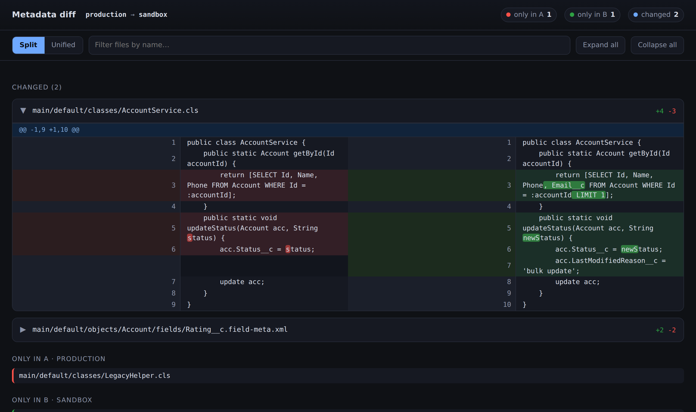

# sf-org-diff

Compare metadata between two Salesforce orgs and get a clean, **pull-request-style visual diff** — without drowning in the false differences that a naive text comparison produces.



## Why

Comparing two Salesforce orgs sounds simple, but a plain text diff is unusable in practice:

- The Metadata API does **not** guarantee a stable order for child elements, so functionally identical files produce huge phantom diffs.
- Profiles and permission sets are massive and ordering-sensitive.
- Org-specific values (IDs, URLs, API versions) clutter the output.

This tool retrieves both orgs, **canonicalizes the XML** (pretty-print + sort sibling elements) so ordering noise disappears, then renders the real differences in a browser — split/unified views, color-coded lines, intra-line character highlighting, per-file change counts, sticky headers, and a filter box.

## Prerequisites

- Python 3.9+ (standard library only — no `pip install` needed)
- [Salesforce CLI](https://developer.salesforce.com/tools/salesforcecli) (`sf`), with both orgs authenticated:
  ```bash
  sf org login web --alias prod
  sf org login web --alias uat
  ```

## Installation

**Option 1 — Clone the repo**
```bash
git clone https://github.com/klsomanath/sf-org-diff.git
cd sf-org-diff
```

**Option 2 — Download just the two files**

Grab these two files from the [releases page](https://github.com/klsomanath/sf-org-diff/releases) and put them in the same folder:
- `compare_orgs.py`
- `report_template.html`

No `pip install` or virtual environment needed — just Python 3.9+ and the `sf` CLI.

## Usage

```bash
python compare_orgs.py prod uat
```

Open the generated `org-compare/report.html` in any browser. The script exits `0` when the orgs match and `1` when they differ, so it drops straight into CI.

### Speed tiers

| Command | What it does |
| --- | --- |
| `python compare_orgs.py prod uat` | Full run: retrieve both orgs, then compare |
| `python compare_orgs.py prod uat --skip-retrieve` | Re-compare already-downloaded source (skips the network) |
| `python compare_orgs.py --html-only` | Instantly re-render `report.html` from cached `diff_data.json` |

### Flags

- `--out ./somewhere` — change the output directory (default `./org-compare`)
- `--metadata ApexClass Flow Profile ...` — override the metadata type list
- `--no-sort` — order-sensitive comparison (disables canonicalization)
- `--no-ignore-whitespace` — treat blank-line / trailing-space differences as real

## Output

Everything lands in the output directory (default `./org-compare/`):

- **`report.html`** — the visual diff. Self-contained; just open it (no server).
- `report.md` — text summary plus only-in-A / only-in-B / changed lists
- `report.csv` — spreadsheet summary: one row per file with its change type, component type, and line counts — opens directly in Excel/Sheets for filtering, sorting, or pivoting
- `diffs/` — one unified `.diff` per changed file (handy for grep / CI logs)
- `diff_data.json` — cached comparison data used by `--html-only`
- `orgA/`, `orgB/` — the retrieved (and normalized) source trees

## Metadata covered

ApexClass, ApexTrigger, PermissionSet, PermissionSetGroup, Flow, Layout, Profile, CustomObject (fields, validation rules, record types, list views, etc.), CustomLabels, CustomMetadata, LightningComponentBundle (LWC), FlexiPage, and StandardValueSet. Add `ApexPage` / `ApexComponent` to the list for Visualforce.

## Customizing the report

The HTML is generated from `report_template.html`, which lives next to the script. Edit that file to change colors, layout, or behavior, then run `--html-only` to re-render instantly. Keep both files in the same directory.

## Notes & caveats

1. **Element sorting is the key feature.** Canonicalizing removes ordering noise but means order-only differences (e.g. the visual field order on a layout) won't be flagged. Use `--no-sort` if you need order-sensitive comparison.
2. **Profiles are inherently noisy across orgs** — a profile only contains permissions for metadata that exists in *that* org.
3. **StandardValueSet wildcard support is flaky.** If none are retrieved, list them explicitly, e.g. `--metadata "StandardValueSet:CaseStatus" "StandardValueSet:LeadStatus"`.
4. **Org-specific values still show as real differences** (record type IDs, hardcoded 18-char IDs, named-credential URLs, API versions). To suppress specific ones, add a scrub step in `canonicalize_file`.

## License

MIT — see [LICENSE](LICENSE).